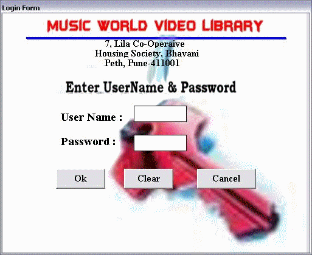



## Video Library

### Description

It is a video library project, in this u can manage your customer details, your Disk details, rent details, listen to sample music and much more. If you like this project then please vote for me.
 
### More Info
 
there is folder Active x control in the project folder copy all its contents in the path c:/windows/system32/

(eg c:/windows/system32/MBPrgBar.ocx)

copy videolibrary.mdb database file in the c:/ drive

you can play only wav files &amp; avi files in this project

             |
---                |---
**Submitted On**   |2008-04-18 00:19:04
**By**             |[Manjeet singh](https://github.com/Planet-Source-Code/PSCIndex/blob/master/ByAuthor/manjeet-singh.md)
**Level**          |Intermediate
**User Rating**    |4.0 (8 globes from 2 users)
**Compatibility**  |VB 6\.0
**Category**       |[Complete Applications](https://github.com/Planet-Source-Code/PSCIndex/blob/master/ByCategory/complete-applications__1-27.md)
**World**          |[Visual Basic](https://github.com/Planet-Source-Code/PSCIndex/blob/master/ByWorld/visual-basic.md)
**Archive File**   |[Video\_Libr2109904172008\.zip](https://github.com/Planet-Source-Code/manjeet-singh-video-library__1-70428/archive/master.zip)

